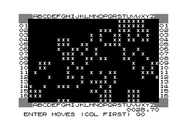

# Hampson's Plane Game (flicker-free)

This program is a Z80 machine-code implementation of the game Hampson's Plane, originally written by Mike Hampson (in BASIC) in 1982 and later ported to Forth as an example program for [CP Software's Spectrum Forth compiler](https://spectrumcomputing.co.uk/entry/8742/ZX-Spectrum/Spectrum_FORTH). 



I ported the game to learn how to create a flicker-free game on the ZX80 and also because I thought the ZX80 (and Minstrel 2) needed a bit more software.

This version runs on a PAL-model ZX80, fitted with the 4K 'Integer' ROM and at least 4K of RAM, or on a [Minstrel 2](http://blog.tynemouthsoftware.co.uk/2022/02/minstrel-final-edition-kits.html). You can also run the game in an emulator (e.g., [EightyOne](https://sourceforge.net/projects/eightyone-sinclair-emulator/)).

The game will not work with the 8K 'Floating Point' ROM nor will it run on a ZX81.

## Loading Hampson's Plane

There are two formats of the program available. The easiest to load is [hampson.o](hampson.o), which is a tape archive file suitable for use with a ZXPand device or most emulators. If using a ZXPand device, copy 'hampson.o' to the SD card on the device and then enter `LOAD "hampson"` to load the game into memory. If using an emulator, open the 'hampson.o' file and enter `LOAD` on the command line.

There is also a [WAV](hampson.wav) file that can be played from a PC or MP3 player into a ZX80 or Minstrel 2 via the 'Ear' socket. Enter `LOAD` on the ZX80 (or Minstrel 2) and then start playback of the WAV file. You will be likely to need a little trial and error to get the volume level right.

Once loaded, enter `GOTO 100` to start the game.


## Playing the Game

The aim of the game is to clear the grid by removing all of the asterisks. Each move, you enter a coordinate (column first) to flip a tile from asterisk to space or vice versa. However, the move will also flip the tiles that border the cell you select, making it a little more tricky. A timer will record how long it takes you to clear the grid, providing a little more excitement.

Coordinates are enterer as three-character references, with a letter followed by two digits. For example, enter "A", "1", "2" to specify cell A12, or "U", "0", "2" to select cell "U2". Invalid inputs are discarded.


## Building from Source

You can, if you wish, assemble the game yourself. For this, you will need a PC with an emulator (such as EightyOne) and a Z80 cross-assembler (I use the [non-GNU Z80 Assember](https://savannah.nongnu.org/projects/z80asm)).

The game is contained in a single source file `hampson.asm`, though it does requre character code definitions from `../utilities/zx80_chars.asm`. The source code includes a ZX80 BASIC wrapper to make it easier to load into a ZX80. Once assembled, you should load the resulting code block into an emulator at address 0x4000. Once loaded, you should see a BASIC program on screen, listing from line 100. Before doing anything else, use 'SAVE' to create a proper BASIC loader version of the game. 

The machine code is embedded into REM statements in lines 10, 20, ..., 90. Do not try to list these lines, as this will almost certainly crash the ZX80. I have struggled to get the BASIC code from Line 100 right, so have simply inserted a REM statement telling you how to call the machine code. You may, however, wish to replace the BASIC from line 100 with something like:

```
100 RANDOMISE USR(16428)
110 REM HAMPSONS PLANE
120 REM
130 REM TO RUN, ENTER
140 REM "GOTO 100"
```

## Development

I wrote this game to get to grips with flicker-free game writing for the ZX80 and Minstrel 2. Paul Farrow's guide to the [Flicker-free Mechanism](http://www.fruitcake.plus.com/Sinclair/ZX80/FlickerFree/ZX80_DisplayMechanism.htm) is particularly useful for learning to do this, as is the listing of the flicker-free [Breakout](http://www.fruitcake.plus.com/Sinclair/ZX80/FlickerFree/ZX80_Breakout.htm) game, by Macronics.

I have adopted the approach used by Breakout, which splits the game code into a sequence of functional units that can be fitted in the time taken to produce the VSync signal at the beginning of each display frame.

The VSync signal is turned on and off with two I/O statements: `in a,(0xFE)` and `out (0xFE),a`, respectively. Between these two commands, you have 1,360 T states of 'spare' time in which you can execute code (see Paul Farrow's guide for details of the timing).

I have written a simple sequencer which will run a step of the game's pipeline using a lookup tables of addresses of routines.

The game sequence is, as follows:

1. Input skill level
2. Randomise game board (Part 1)
3. Randomise game board (Part 2)
4. Read in column id
5. Read in row id (first digit)
6. Read in row id (second digit)
7. Flip tile (Part 1)
8. Flip tile (Part 2)
9. Check if solved (jump to 4, if not)
10. Congratulate player (return to 1 on keypress)

The sequencer itself requires 77 T states, leaving 1,287 T states for the functionality of each game step. The game will only move from one step to the next, if a certain condition is met. For example, the game will only move from Step 1 to Step 2, if the user presses a valid key (selecting a skill level between 1 and 9).

There seems to be some flexibility in exactly how long a game step is -- possibly anything within around 10 T states of the target of 1,287 is good enough. If the routine length is too far from the target, the screen will be displayed offset or will flicker.

Initially, I intended to write a separate routine to check if the player had solved the grid -- that is, checking there were no asterisks left on the grid. However, this proved far too time-consuming. I had intended to use the CPIR command to scan through the display file for an asterisk. However, to check the whole board would require around 10,000 T states, or around 8 times the time available between frames. Instead I track the number of asterisks throughout the game, updating the count ever time a block of tiles is flipped. This works well, though on top of other tasks, a player flipping a tile now requires  two frames.
