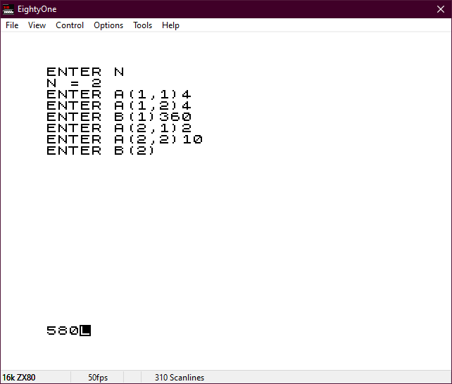
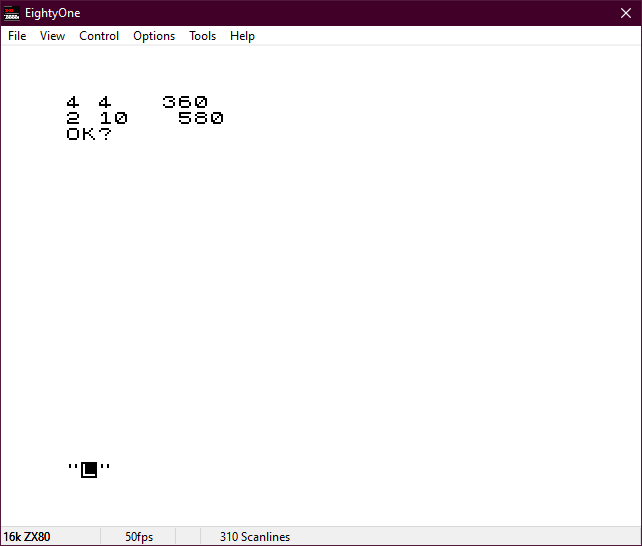
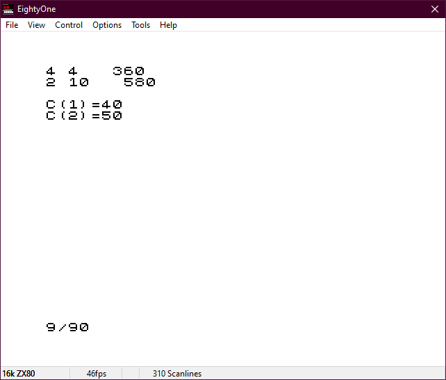

# Simple linear-system solver

This program is a BASIC implementation of Gaussian elimination and back-substitution, to solve a system of linear equations.

It can be run on a ZX80 (with 8K ROM) or a ZX81. It is not compatible with the original ZX80 4K ROM, as it requires floating-point arithmetic.

To use the program:

1. Type `LOAD "LINALG"`
2. Type `RUN`
3. Enter the size of the system to be solved
4. Enter the system row by row (including the right-hand side)
5. Check the system has been entered correctly: enter `Y` to confirm or `N` to reenter
6. The computer will solve the system (assuming it is solveable)

**Example:** if four apples and four oranges cost £3.60 and two apples and 10 oranges cost £5.80, how much does each apple and each orange cost?

**Solution:** Convert the problem to a linear system:

```
4.x + 4.y = 360
2.x + 10.y = 580
```

--where x is the price of an apple and y is the price of an orange.

This can be represented in matrix form as:

```
/        \  /     \   /     \
|  4  4  |  |  x  |   | 360 |
|        |  |     | = |     |
|  2 10  |  |  y  |   | 580 |
\        /. \     /   \     /
```

This can be entered into the ZX80 (or ZX81) and solved as shown in the screenshots.

 
