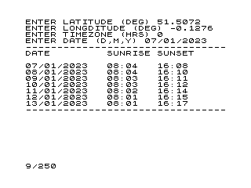

# Sunrise and Sunset Calculator

BASIC program for the ZX80 or Minstrel 2 (with 8K ROM) to calculate the sunrise and sunset times at a given location (latitude and longitude), time zone, and date in the year.

The program requires at least 4K of RAM to run.

Once loaded (or typed in), type `RUN` and enter required information in response to the prompts.

The program takes around 12 seconds to compute the sunrise and sunset times for a one-week period from the date specified. As is normal for the ZX80, the screen is not updated while the calculation is in progress.

Notes:
- Northern latitudes and Eastern longitudes are positive. So, for example, London's coordinates would be specified as +51.5072 and -0.1276, respectively. As another example, Rio de Janeiro's coordinates would be -22.9068 and -43.1729, respectively.
- The timezone is specified as an adjustment to UTC time -- e.g., +1 for British Summer Time (BST).
- Dates should be entered one component at a time -- e.g., 1st March 2023 would be entered as `1`, `<Enter>`, `3`, `<Enter>`, `2023`, `<Enter>`.

## Acknowledgement

The program is adapted from a BBC Micro listing created by R.G. Stuart of Mexico City, Mexico, and published in Sky and Telescope magazine (Sinnott, Roger W. "Sunrise Sunset Challenge: The Winners." Sky and telescope 89.3 (1995): 84-. Print).
